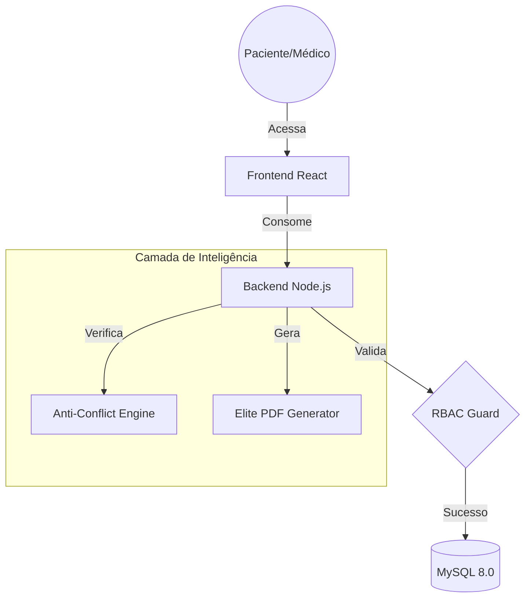

<div align="center">
  
  
  # 🏥 VitalHub Enterprise Ecosystem
  
  **A próxima geração em gestão clínica e telemedicina.**
  
  [Website Oficial](https://clinica-vita.vercel.app) · [Documentação API](https://github.com/AlexandreCalmonJr/agendafacil-api#endpoints) · [Reportar Bug](https://github.com/AlexandreCalmonJr/vitalhub-enterprise/issues)
  
  <br />
  
  <p align="center">
    
    
    
    
    
  </p>
</div>

---

## 💎 O Ecossistema

Este repositório é o **Container Principal (Monorepo)** que orquestra a plataforma VitalHub. Ele utiliza **Git Submodules** para manter o Frontend e o Backend desacoplados, permitindo um desenvolvimento ágil e escalável.

### 🧩 Submódulos Integrados

| Módulo | Repositório | Descrição |
|:-------|:------------|:----------|
| ⚙️ **Core API** | [`agendafacil-api`](https://github.com/AlexandreCalmonJr/agendafacil-api) | Motor de regras de negócio, autenticação JWT e inteligência anti-conflito. |
| 💊 **Web Portal** | [`agendafacil-front`](https://github.com/AlexandreCalmonJr/agendafacil-front) | Interface Premium com Glassmorphism, Dashboards Analytics e Multi-perfil. |

---

## 🚀 Arquitetura de Fluxo



---

## 🌟 Destaques do Projeto

### 🔐 Segurança & Acesso (RBAC)
O sistema possui 4 níveis de privilégios totalmente isolados:
*   **Administrador**: Controle total do ecossistema e usuários.
*   **Recepcionista**: Gestão operacional de fluxo e faturamento.
*   **Médico**: Painel de atendimento clínico e prontuários SOAP.
*   **Paciente**: Auto-agendamento e histórico de saúde digital.

### 📅 Agendamento Inteligente
Motor de busca que calcula slots livres baseados na duração real de cada serviço, impedindo conflitos de horários tanto para o profissional quanto para o paciente.

### 📊 Dashboards & Analytics
Visualização em tempo real de métricas críticas (Receita, Fluxo de Pacientes, Status de Atendimento) utilizando `Recharts`.

---

## 🛠️ Guia de Instalação Rápida

### Clonando o Ecossistema Completo
Para baixar o projeto com todos os submódulos de uma vez:
```bash
git clone --recursive https://github.com/AlexandreCalmonJr/vitalhub-enterprise.git
```

### Rodando o Ambiente
1.  **Banco**: Importe o [`schema.sql`](https://github.com/AlexandreCalmonJr/agendafacil-api/blob/main/database/schema.sql) no MySQL.
2.  **API**: `cd agendafacil-api && npm install && node server.js`
3.  **Front**: `cd agendafacil-front && npm install && npm run dev`

---

## 🔐 Credenciais de Teste (Senha: `123456`)

| Perfil | E-mail |
|:-------|:-------|
| 🔴 Admin | `admin@clinica.com` |
| 🟢 Médica | `ana.silva@clinica.com` |
| 🔵 Paciente | `maria.santos@email.com` |
| 🟠 Recepção | `recepcao@clinica.com` |

---

## 📄 Licença
Este projeto está sob a licença [MIT](LICENSE).

<div align="center">
  <sub>Desenvolvido com 💚 para <strong>Clínica Vita</strong> — VitalHub Enterprise Platform v2.0</sub>
</div>
