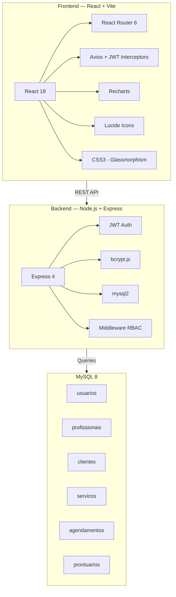
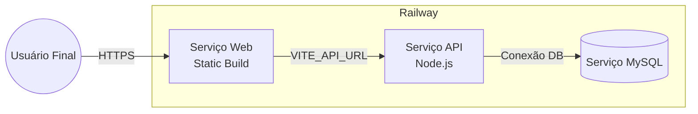

<p align="center">
  
  
  
  
  
</p>

<h1 align="center">Clínica Vita — VitalHub Enterprise Platform</h1>

<p align="center">
  <strong>Sistema de gestão abrangente para clínicas médicas</strong><br/>
  Agendamento avançado · Prontuários eletrônicos · Controle financeiro · Gestão de acessos por perfil
</p>

<p align="center">
  
  
  
  
  
</p>

---

## Aprimoramentos de Arquitetura (v2.0)

Nesta versão, a infraestrutura do repositório foi atualizada para o padrão **Enterprise**, com as seguintes implementações:

*   **Interface Minimalista**: Implementação de um design centralizado com foco na eficiência operacional e experiência do usuário.
*   **Documentação Técnica**: Inclusão de diagramas **Mermaid** detalhando fluxos críticos como RBAC (Controle de Acesso Baseado em Perfil) e o Motor de Disponibilidade.
*   **Orquestração de Monorepo**: Estrutura organizada para gerenciar projetos independentes e desacoplados em um único repositório.
*   **Licença de Uso**: Adoção da licença MIT para assegurar transparência e conformidade legal do código-fonte.
*   **Padronização de Setup**: Documentação rigorosa de procedimentos para integração de novos colaboradores e ambientes de desenvolvimento.

---

## Visão Geral

O **VitalHub** é uma solução ERP modular projetada para otimizar processos desde o atendimento na recepção até o acompanhamento clínico. A plataforma oferece fluxos de trabalho especializados para cada categoria de usuário:

| Perfil | Interface | Funcionalidades Principais |
|:-------|:-------|:--------------------------|
| **Administrador** | Hub Operacional | Gestão estratégica, administração de contas e indicadores de desempenho. |
| **Recepcionista** | Hub Operacional | Gerenciamento de agendas, fluxos de check-in e controle de faturamento. |
| **Profissional** | Painel Médico | Gestão de fila de atendimento, prontuário eletrônico (SOAP) e prescrições. |
| **Paciente** | Portal do Paciente | Autoatendimento para agendamentos, histórico clínico e telemedicina. |

---

## Estrutura Tecnológica



---

## Estrutura do Repositório

```
clinica-vita/
│
├── README.md                    ← Documentação principal
│
├── agendafacil-api/             ← Backend (Node.js + Express)
│   ├── server.js                   # Ponto de entrada
│   ├── src/
│   │   ├── config/database.js      # Configuração de banco de dados
│   │   ├── controllers/            # Lógica de negócio
│   │   ├── routes/                 # Definição de rotas
│   │   └── middleware/             # Segurança e autenticação
│   ├── database/
│   │   ├── schema.sql              # Estrutura do banco
│   │   └── seed.sql                # Dados iniciais para teste
│   └── README.md                # Documentação técnica da API
│
├── agendafacil-front/           ← Frontend (React + Vite)
│   ├── src/
│   │   ├── pages/                  # Interfaces do sistema
│   │   ├── components/             # Componentes reutilizáveis
│   │   ├── styles/                 # Estilização modular
│   │   ├── contexts/               # Gerenciamento de estado global
│   │   ├── services/api.js         # Integração com API
│   │   └── utils/pdfGenerator.js   # Utilitário de exportação PDF
│   └── README.md                # Documentação técnica do Frontend
│
└── Documentação detalhada disponível nos diretórios internos
```

---

## Configuração do Ambiente Local

### Pré-requisitos

| Componente | Versão | Requisito |
|:-----------|:-------|:------------|
| Node.js | 18 ou superior | Essencial |
| MySQL | 8 ou superior | Essencial |
| npm | 9 ou superior | Integrado ao Node |
| Git | 2 ou superior | Recomendado |

### 1. Preparação do Banco de Dados

```bash
# Executar a criação da estrutura
mysql -u root -p < agendafacil-api/database/schema.sql

# Inserir dados de teste
mysql -u root -p < agendafacil-api/database/seed.sql
```

### 2. Configuração do Backend

```bash
cd agendafacil-api
npm install

# Configurar variáveis de ambiente
cp .env.example .env
# Configure suas credenciais no arquivo .env

# Iniciar o serviço (disponível em http://localhost:3001)
node server.js
```

### 3. Configuração do Frontend

```bash
cd agendafacil-front
npm install

# Configurar conexão com a API
echo "VITE_API_URL=http://localhost:3001/api" > .env

# Iniciar o servidor de desenvolvimento (disponível em http://localhost:5173)
npm run dev
```

---

## Credenciais para Homologação

Senha padrão para todos os perfis: **`123456`**

| Perfil | Identificação | E-mail de Acesso | Escopo de Visibilidade |
|:-------|:-----|:-------|:---------|
| Admin | Administrador Vita | `admin@clinica.com` | Acesso integral ao sistema e indicadores. |
| Médico | Dra. Ana Silva | `ana.silva@clinica.com` | Dashboard clínico e prontuários. |
| Médico | Dr. Roberto Santos | `roberto.santos@clinica.com` | Dashboard clínico e prontuários. |
| Paciente | Maria Santos | `maria.santos@email.com` | Agendamentos e histórico pessoal. |
| Recepção | Patrícia Staff | `recepcao@clinica.com` | Agenda operacional e check-in. |

---

## Matriz de Controle de Acesso (RBAC)

O sistema implementa segurança baseada em funções, aplicada tanto na interface quanto nas requisições ao servidor.

| Funcionalidade | Admin | Recepção | Médico | Paciente |
|:---------------|:--------:|:-----------:|:---------:|:-----------:|
| Hub Operacional (Métricas e Faturamento) | Permitido | Permitido | Negado | Negado |
| Agenda Global (Multi-profissional) | Permitido | Permitido | Negado | Negado |
| Agendamento em nome de terceiros | Permitido | Permitido | Negado | Negado |
| Gestão de Contas de Usuário | Permitido | Negado | Negado | Negado |
| Painel de Atendimento Clínico | Permitido | Negado | Permitido | Negado |
| Prontuário e Prescrição Digital | Permitido | Negado | Permitido | Negado |
| Autoagendamento | Negado | Negado | Negado | Permitido |

---

## Implementação em Nuvem (Railway)

### Arquitetura de Deploy



### Procedimentos de Implantação

**1. Serviço de Banco de Dados**
1. Instancie o serviço MySQL no Railway.
2. Utilize as variáveis geradas automaticamente (`MYSQLHOST`, `MYSQLUSER`, etc.).
3. Execute os scripts de estrutura e semente via CLI.

**2. Serviço de API (Backend)**
1. Vincule o repositório `agendafacil-api`.
2. Configure as variáveis de ambiente necessárias.
3. Comando de Build: `npm install`.

**3. Serviço Frontend**
1. Vincule o repositório `agendafacil-front`.
2. Defina a variável `VITE_API_URL` apontando para a API pública.
3. Comando de Build: `npm install && npm run build`.

> [!IMPORTANT]
> **Segurança de Dados**: Evite a persistência de credenciais ou URLs estáticas no código-fonte. Utilize estritamente variáveis de ambiente para assegurar a portabilidade do sistema.

---

## Funcionalidades de Destaque

| Recurso | Descrição Técnica |
|:--------|:----------|
| **Glassmorphism Interface** | Interface moderna com efeitos de transparência e profundidade. |
| **Dynamic Dark Mode** | Suporte a temas claro e escuro integrado ao portal. |
| **Intelligent Wizard** | Fluxo de agendamento assistido com validação em tempo real. |
| **Business Analytics** | Visualização de dados operacionais via Recharts. |
| **Document Generation** | Emissão automatizada de receituários e solicitações em formato PDF. |
| **Collision Engine** | Prevenção de conflitos de horários em nível de banco de dados e UI. |
| **Telemedicine Integration** | Suporte a links de atendimento remoto integrados ao agendamento. |
| **Notifications Service** | Sistema de status e alertas visuais para acompanhamento de fluxos. |

---

## Histórico de Versões

### **v2.0 — Enterprise Update (Atual)**
*   Aprimoramento da arquitetura para Monorepo.
*   Implementação de RBAC avançado com quatro níveis de permissão.
*   Motor de validação de disponibilidade (Backend + Frontend).
*   Nova interface de Atendimento Premium e Gestão de Exames.
*   Dashboard de Analytics integrado.

### **v1.0 — MVP**
*   Funcionalidade base de agendamento.
*   Autenticação via JWT.
*   Gestão básica de usuários e profissionais.

---

<p align="center">
  <strong>Clínica Vita</strong> — VitalHub Enterprise Platform v2.0<br/>
  Solução de alta performance para gestão clínica full-stack.
</p>
