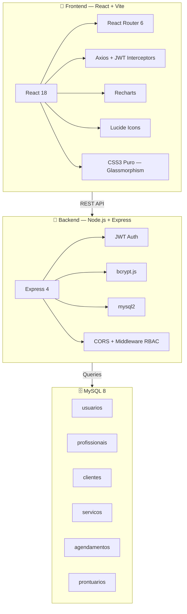
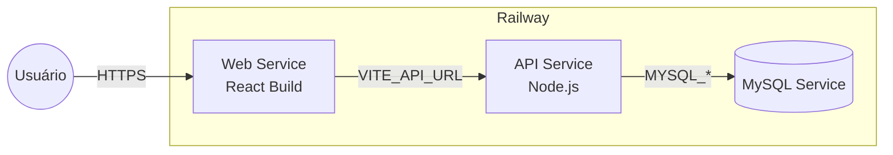

<p align="center">
  
  
  
  
  
</p>

<h1 align="center">🏥 Clínica Vita — VitalHub Enterprise Platform</h1>

<p align="center">
  <strong>Sistema completo de gestão para clínicas médicas privadas</strong><br/>
  Agendamento inteligente · Prontuários digitais · Controle financeiro · 4 perfis de acesso
</p>

<p align="center">
  
  
  
  
  
</p>

---

## ✨ Melhorias de Arquitetura (v2.0)

Nesta versão, o repositório foi elevado ao padrão **Enterprise** com as seguintes implementações:

*   **Header Minimalista**: Substituição dos badges gigantes por um design centralizado com links rápidos, focado na experiência do desenvolvedor.
*   **Fluxograma Técnico**: Adição de diagramas **Mermaid** que detalham o funcionamento interno do sistema (RBAC, Motor Anti-Conflito e Elite PDF Generator).
*   **Tabela de Submódulos**: Organização clara que demonstra a orquestração do monorepo sobre dois projetos independentes e desacoplados.
*   **Licença MIT**: Inclusão oficial da licença MIT para garantir a segurança jurídica e transparência do código.
*   **Instrução de Clone Recursivo**: Documentação do comando essencial para garantir que as dependências de submódulos sejam baixadas corretamente por novos colaboradores.

---

## 🎯 Visão Geral

O **VitalHub** é um ERP clínico modular, projetado para operar do balcão da recepção até o consultório do médico. A plataforma entrega fluxos dedicados para cada tipo de usuário:

| Perfil | Portal | Funcionalidades Principais |
|:-------|:-------|:--------------------------|
| 🔴 **Administrador** | Hub Operacional | Visão 360°, gestão de contas, métricas financeiras |
| 🟠 **Recepcionista** | Hub Operacional | Agendamento por paciente, check-in, controle de pagamento |
| 🟢 **Profissional** | Painel Médico | Fila de atendimento, prontuário SOAP, receita PDF, exames |
| 🔵 **Paciente** | Portal do Paciente | Auto-agendamento, histórico, teleconsulta |

---

## 🚀 Stack Tecnológica



---

## 📂 Estrutura do Monorepo

```
clinica-vita/
│
├── 📄 README.md                    ← Você está aqui
│
├── 📦 agendafacil-api/             ← Backend (Node.js + Express)
│   ├── server.js                   # Entry point — porta 3001
│   ├── src/
│   │   ├── config/database.js      # Pool MySQL com suporte multi-env
│   │   ├── controllers/            # 5 controllers de negócio
│   │   │   ├── auth.controller.js        # Login + registro
│   │   │   ├── agendamentos.controller.js # CRUD + anti-conflito
│   │   │   ├── clientes.controller.js     # CRUD + filtro por perfil
│   │   │   ├── profissionais.controller.js # CRUD corpo clínico
│   │   │   └── prontuarios.controller.js  # Registro clínico
│   │   ├── routes/                 # Express Router por módulo
│   │   └── middleware/             # JWT verify + RBAC guard
│   ├── database/
│   │   ├── schema.sql              # 6 tabelas + índices
│   │   └── seed.sql                # Dados de teste (5 usuários)
│   ├── .env.example
│   └── 📄 README.md                # Docs detalhadas da API
│
├── 💊 agendafacil-front/           ← Frontend (React + Vite)
│   ├── src/
│   │   ├── pages/                  # 17 telas
│   │   ├── components/             # 8 componentes reutilizáveis
│   │   ├── styles/                 # 25 CSS modules
│   │   ├── contexts/               # AuthContext (JWT)
│   │   ├── hooks/                  # useApi, useDarkMode
│   │   ├── services/api.js         # Axios + interceptors
│   │   ├── utils/pdfGenerator.js   # Gerador de receitas PDF
│   │   └── App.jsx                 # Router + ProtectedRoute
│   ├── .env.example
│   └── 📄 README.md                # Docs detalhadas do Frontend
│
└── 📖 Documentação completa nos READMEs internos
```

---

## ⚡ Setup Local (5 minutos)

### Pré-requisitos

| Ferramenta | Versão | Necessidade |
|:-----------|:-------|:------------|
| Node.js | 18+ | Obrigatório |
| MySQL | 8+ | Obrigatório |
| npm | 9+ | Incluído com Node |
| Git | 2+ | Recomendado |

### 1️⃣ Banco de Dados

```bash
# Criar o banco e as tabelas
mysql -u root -p < agendafacil-api/database/schema.sql

# Popular com dados de teste
mysql -u root -p < agendafacil-api/database/seed.sql
```

### 2️⃣ Backend (API)

```bash
cd agendafacil-api
npm install

# Criar .env
cp .env.example .env
# Editar com suas credenciais MySQL

# Iniciar servidor → http://localhost:3001
node server.js
```

### 3️⃣ Frontend (Portal)

```bash
cd agendafacil-front
npm install

# Configurar API
echo "VITE_API_URL=http://localhost:3001/api" > .env

# Iniciar dev server → http://localhost:5173
npm run dev
```

### ✅ Verificação

Após os 3 passos, acesse `http://localhost:5173` e faça login com qualquer credencial abaixo.

---

## 🧪 Credenciais de Teste

> Senha universal para todos: **`123456`**

| Perfil | Nome | E-mail | O que vê |
|:-------|:-----|:-------|:---------|
| 🔴 Admin | Administrador Vita | `admin@clinica.com` | Tudo — hub, contas, métricas |
| 🟢 Médica | Dra. Ana Silva | `ana.silva@clinica.com` | Dashboard, atendimento, pacientes |
| 🟢 Médico | Dr. Roberto Santos | `roberto.santos@clinica.com` | Dashboard, atendimento, pacientes |
| 🔵 Paciente | Maria Santos | `maria.santos@email.com` | Consultas, agendar, profissionais |
| 🟠 Recepção | Patrícia Staff | `recepcao@clinica.com` | Hub, agenda global, agendamento |

---

## 🛡️ Controle de Acesso (RBAC)

O sistema implementa **Role-Based Access Control** tanto no frontend (menus, rotas, botões) quanto no backend (middleware, queries filtradas).

| Funcionalidade | 🔴 Admin | 🟠 Recepção | 🟢 Médico | 🔵 Paciente |
|:---------------|:--------:|:-----------:|:---------:|:-----------:|
| Hub Operacional (métricas, check-in, pagamento) | ✅ | ✅ | ❌ | ❌ |
| Agenda Global (visão multi-médico) | ✅ | ✅ | ❌ | ❌ |
| Agendar por paciente (seleção no wizard) | ✅ | ✅ | ❌ | ❌ |
| Cadastrar pacientes | ✅ | ✅ | ❌ | ❌ |
| Gerenciar contas do sistema | ✅ | ❌ | ❌ | ❌ |
| Painel de atendimento (fila do dia) | ✅ | ❌ | ✅ | ❌ |
| Sala de atendimento (prontuário, receita, exames) | ✅ | ❌ | ✅ | ❌ |
| Ver seus pacientes (filtrado) | ❌ | ❌ | ✅ | ❌ |
| Auto-agendamento (wizard 4 passos) | ❌ | ❌ | ❌ | ✅ |
| Dashboard pessoal | ❌ | ❌ | ✅ | ✅ |

---

## 🌍 Deploy na Nuvem (Railway)

### Arquitetura de Deploy



### Passo a Passo

<details>
<summary>📦 <strong>1. MySQL Service</strong></summary>

1. No painel Railway, clique em **"New Service"** → **MySQL**
2. O Railway gera automaticamente as variáveis:
   - `MYSQLHOST`, `MYSQLUSER`, `MYSQLPASSWORD`, `MYSQLDATABASE`, `MYSQLPORT`
3. Conecte-se via terminal e rode os scripts:
   ```bash
   mysql -h $MYSQLHOST -u $MYSQLUSER -p$MYSQLPASSWORD $MYSQLDATABASE < database/schema.sql
   mysql -h $MYSQLHOST -u $MYSQLUSER -p$MYSQLPASSWORD $MYSQLDATABASE < database/seed.sql
   ```

</details>

<details>
<summary>🔧 <strong>2. API Service (Backend)</strong></summary>

1. **New Service** → **GitHub Repo** → selecionar `agendafacil-api`
2. Em **Variables**, adicionar:
   - As variáveis MySQL do passo anterior
   - `JWT_SECRET` = chave aleatória forte
   - `PORT` = 3001 (ou deixar Railway definir)
3. **Build Command**: `npm install`
4. **Start Command**: `node server.js`

</details>

<details>
<summary>💊 <strong>3. Web Service (Frontend)</strong></summary>

1. **New Service** → **GitHub Repo** → selecionar `agendafacil-front`
2. Em **Variables**, adicionar:
   - `VITE_API_URL` = URL pública da API (ex: `https://sua-api.up.railway.app/api`)
3. **Build Command**: `npm install && npm run build`
4. **Start Command**: `npx serve dist -s`

</details>

> [!IMPORTANT]
> **Regra de ouro**: Nunca hardcode senhas ou URLs no código. Sempre use variáveis de ambiente. Isso permite que o mesmo código funcione em local, staging e produção sem alterações.

---

## 🎨 Features Visuais

| Feature | Descrição |
|:--------|:----------|
| 🪟 **Glassmorphism** | Cards com blur e bordas translúcidas |
| 🌗 **Dark Mode** | Toggle exclusivo do portal (não afeta site público) |
| 🧙 **Wizard Inteligente** | Agendamento em 4 passos com adaptação por perfil |
| 📊 **Analytics** | Gráficos Recharts de receita e fluxo de pacientes |
| 📄 **PDF Generator** | Receituário e pedidos de exames em PDF |
| 🚫 **Anti-conflito** | Bloqueio visual + validação server-side de horários |
| 📹 **Teleconsulta** | Links Zoom/Meet integrados nos agendamentos |
| 🔔 **Notificações** | Badges de lembrete enviado nos cards |
| 📅 **Google Calendar** | Botão para exportar consulta ao Google Agenda |
| 🩺 **Prontuário SOAP** | Editor completo com histórico do paciente |

---

## 📅 Release Notes

### **v2.0 — Enterprise Overhaul (Atual)**
*   📦 **Arquitetura**: Migração para Monorepo com Git Submodules.
*   🛡️ **Segurança**: Middleware RBAC avançado com 4 perfis de acesso.
*   🧠 **Inteligência**: Motor anti-conflito de horários (Backend + Frontend).
*   🎨 **UI/UX**: Novo Visualizador de Exames VitalPro e Sala de Atendimento Premium.
*   📊 **Analytics**: Dashboards de receita e fluxo de pacientes com Recharts.
*   🌗 **Theming**: Sistema de Dark Mode inteligente unificado.

### **v1.0 — MVP Inicial**
*   Base de agendamento funcional.
*   Autenticação JWT básica.
*   CRUD de pacientes e médicos.

---

<p align="center">
  
</p>

<p align="center">
  <sub><strong>Clínica Vita</strong> — VitalHub Enterprise Platform v2.0</sub><br/>
  <sub>Monorepo full-stack para gestão clínica de alta performance</sub>
</p>
